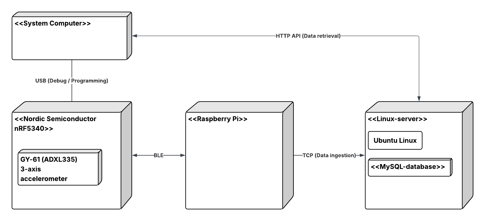
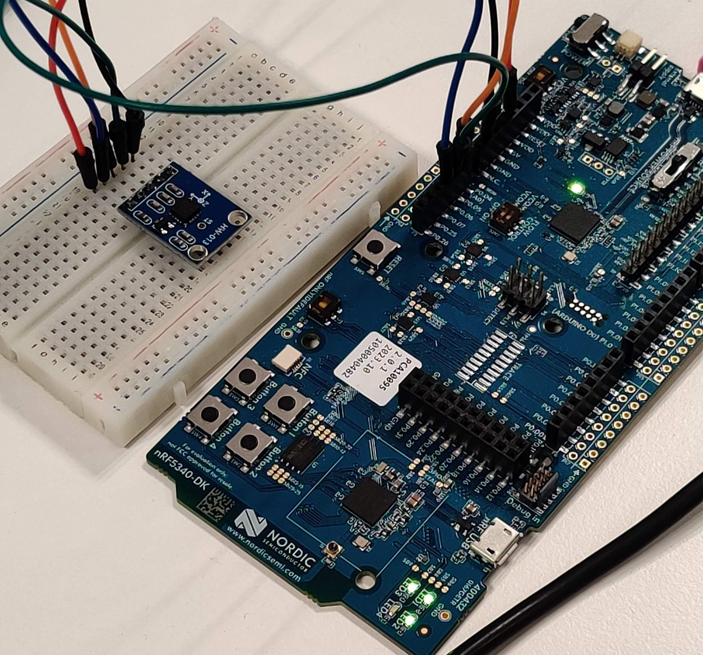
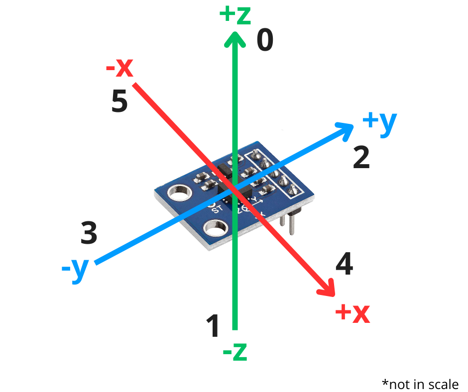
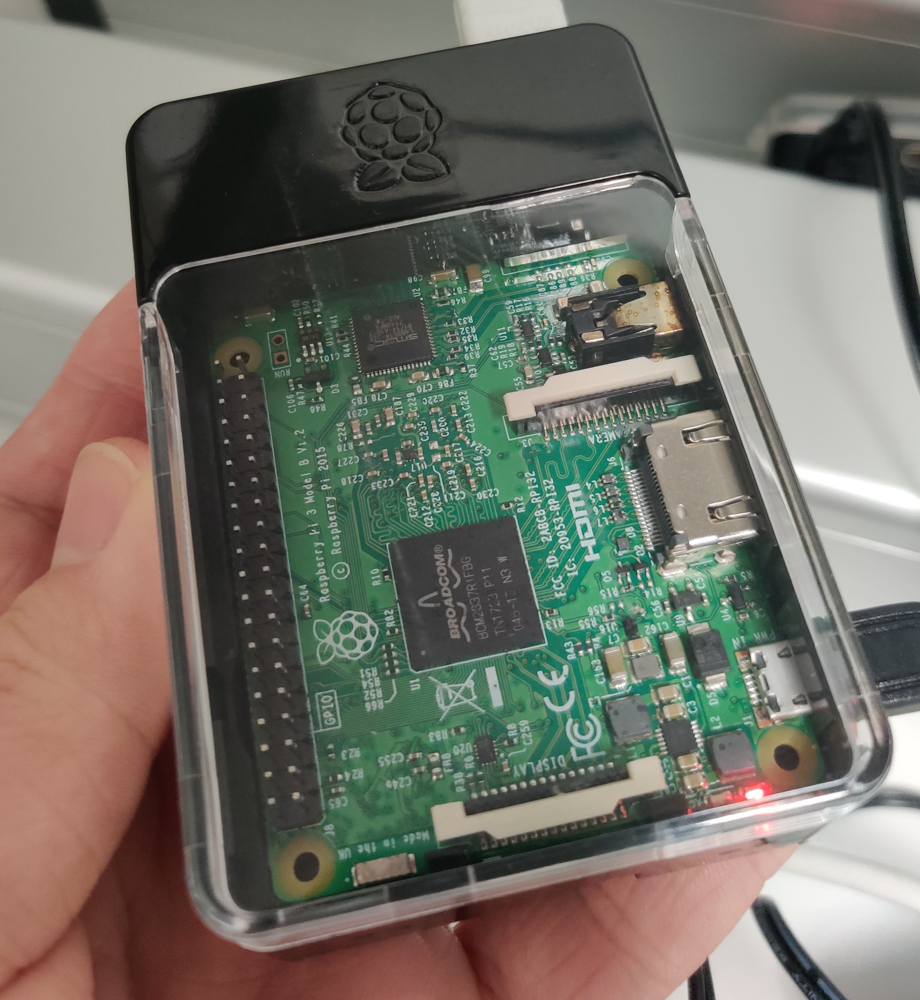
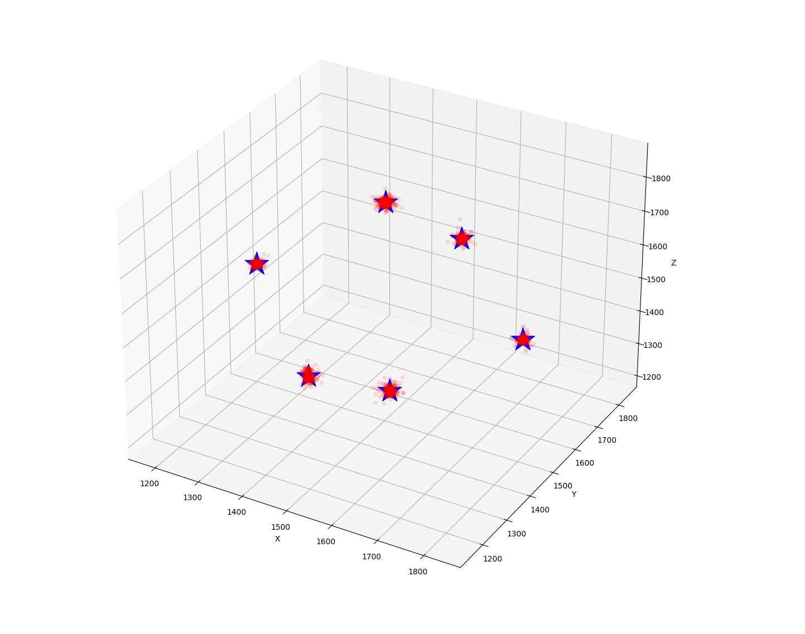
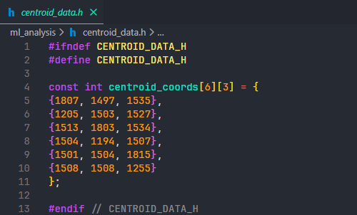
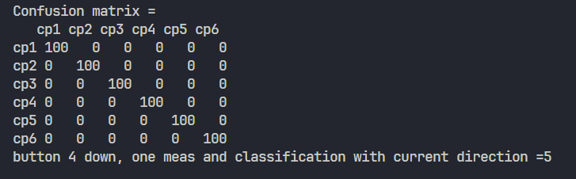

# Tietoliikenteen sovellusprojekti

## Sisällysluettelo

- [Kuvaus](#kuvaus)
- [Vaiheet](#vaiheet)
- [Arkkitehtuuri](#arkkitehtuuri)
- [Komponenttikohtainen kuvaus](#komponenttikohtainen-kuvaus)
  - [nRF5430DK + GY-61-kiihtyvyysanturi](#nrf5430dk--gy-61-kiihtyvyysanturi)
  - [Raspberry Pi 3 Model B](#raspberry-pi-3-model-b)
  - [Ubuntu serveri](#ubuntu-serveri)
  - [PC](#pc)
- [Projektin tekijät](#projektin-tekijät)
- [Lisenssi](#lisenssi)

## Kuvaus

Oulun Ammattikorkeakoulun tieto- ja viestintätekniikan 2. vuosikurssin opiskelijoiden "Tietoliikenteen sovellusprojekti" syksyllä 2025.

Kehitysalusta nRF5340DK mittaa GY-61-kiihtyvyysanturilla dataa ja välittää datan langattomasti IoT-reitittimelle (Raspberry Pi). Raspberry Pi välittää dataa omalle MySQL-palvelimelle.

Tietokantaan tallentuvaan dataan on TCP-sokettirajapinta ja yksinkertainen HTTP API. Kerättyä dataa haetaan HTTP-rajanpinnasta omaan kannettavaan koodatulla Python-ohjelmalla ja käsitellään koneoppimistarkoituksiin.

## Vaiheet

1. Mitataan GY-61-kiihdytysanturin XYZ-suuntadataa nRF5340DK-kehitysalustalla.
2. Data lähetetään BLE-yhteyden kautta IoT-reitittimenä toimivalle Raspberry Pi -alustalle.
3. Raspberry Pi välittää datan TCP-sokettirajapinnan kautta Oamkin MySQL-palvelimelle.
4. Tietokantaan tallennettu data haetaan HTTP-rajapinnan kautta tietokoneelle.
5. Haettu data käsitellään KMeans-luokittelualgoritmilla.

## Arkkitehtuuri

Arkkitehtuurikaaviossa esitellään projektin keskeisimmät komponentit. Komponentteja ja niiden tehtäviä esitellään tarkemmin otsikossa [Komponenttikohtainen kuvaus](#komponenttikohtainen-kuvaus).

## Komponenttikohtainen kuvaus

### nRF5430DK + GY-61-kiihtyvyysanturi

- adc.c -ohjelma

  - Alustaa ADC-kanavat, mittaa kiihtyvyysanturin jännitearvoja ja tallentaa ne tietueeseen (struct) lähettämistä varten.

- BLE GATT Server -ohjelma

  - Ohjelman tarkoitus on yhdistää Raspberry Pi -alustaan, mainostaa olemassaoloaan (advertising) ja yhteyden muodostaessaan lähettää mitattua anturidataa ilmoituksien (notifications) kautta.
  - GAP-yhteysrooli on Peripheral.

  nRF5340DK ja GY-61-kiihtyvyysanturi ovat valmiita mittaukseen:

  
\n

  GY-61-kiihtyvyysanturi ja XYZ-akselit. Arvot akselinimien vieressä ovat sensorisuuntia (0-5):

  
\n

### Raspberry Pi 3 Model B

- BLE GATT Client -ohjelma

  - Ohjelma skannaa bluetooth-laitteita, yhdistää nRF5340DK-kehitysalustaan ja tilaa (subscribes) anturidataa sisältäviä BLE ilmoituksia.

  - Lisäksi Raspberry lähettää saapuneen anturidatan MySQL-tietokantaan TCP-protokollan avulla.

  - GAP-yhteysrooli on Central.

  

### Ubuntu serveri

- MySQL-tietokanta

  - Sisältää tietokantaan lähetettyä GY-61-kiihtyvyysanturin XYZ-dataa ja suunta-arvot.

- firewall.bash

  - Suodattaa Oamkin verkon ulkopuolelta tulevaa liikennettä.

- db_fetch -ohjelma

  - Pieni PHP-skripti tietokannassa sijaitsevan datan hakemiseen ja näyttämiseen Apache web-palvelimella. Lisäsimme 404-virheen väärän osoitteen asettamisesta.

### PC

- tcp_datafetcher -ohjelma

  - Hakee TCP-protokollan avulla mittausdataa MySQL-tietokannasta ja tallentaa sen measurementdata.csv tiedostoksi.

- kmeans_algorithm -ohjelma

  - Lukee measurementdata.csv tiedoston ja piirtää XYZ-datapisteet 3D-taulukkoon. Tämän jälkeen ohjelma asettaa keskipisteille (centroids) omat datajoukot (clusters) ja laskee jokaiselle keskipisteelle etäisyyden datajoukon pisteisiin. Keskipiste "voittaa" lyhyimmällä etäisyydellä olevan datapisteen itselleen. Etäisyyslaskun ja "voitettujen" datapisteiden perusteella keskipiste saa omat XYZ-koordinaatit.
  - Kuuden keskipisteen XYZ-koordinaatit tallennetaan centroid_coords -taulukkoon centroid_data.h-tiedoston sisälle.

  Keskipisteet (siniset tähdet) ovat laskettu datajoukkojen keskelle.
  

  centroid_data.h tiedoston 6x3 taulukossa keskipisteet ovat järjestyksessä (ylhäältä alas): `high x`, `low x`, `high y`, `low y`, `high z` ja `low z`.
  

- confusion_matrix -ohjelma

  - Ohjelma käyttää kmeans_algorithm -ohjelman tuottamaa centroid_data.h-tiedostoa ja nRF5340DK-kehitysalustalla mitattuja XYZ-arvoja. Tuloksena syntyy 6x6 kokoinen "confusion matriisi", jonka avulla kmeans_algorithm -ohjelman luokittelukykyä voidaan arvioida.

  X-akselilla keskipisteen "voitetut" datapisteet ja Y-akselilla mitattu asento. Diagonaalinen tulosjono kertoo hyvästä luokittelusta.

  

## Käytetyt teknologiat

| Alustat ja laitteet           | Kuvaus                                                                |
| ----------------------------- | --------------------------------------------------------------------- |
| Raspberry Pi 3 Model B        | Minitietokone, joka käyttää Raspberry Pi OS -käyttöjärjestelmää       |
| Nordic nRF5340DK              | Nordic Semiconductors:in kehitysalusta                                |
| Ubuntu Server                 | Virtuaaliserveri, joka käyttää Ubuntu 24.04.3 LTS -käyttöjärjestelmää |
| GY-61-kiihtyvyysanturi        | 3-akselinen kiihtyvyysanturi (ADXL335)                                |
| PC                            | Kannettava tietokone (Windows 11 ja Fedora Linux)                     |
|                               |                                                                       |
| Kehitysalustat ja ohjelmistot |                                                                       |
|                               |                                                                       |
| Visual Studio Code            | Ohjelmointiympäristö (IDE)                                            |
| nRF Connect                   | nRF-laitteiden kehitystä tukeva työkalukehys (framework)              |
| GitHub                        | Verkkosivu, joka tarjoaa mm. Git-versionhallinnan                     |
| MySQL                         | Tietokanta-alusta virtuaaliserverillä                                 |
| Apache                        | Käytetään PHP-sivun kanssa                                            |
| Zephyr                        | nRF5340DK:n natiivi RTOS-käyttöjärjestelmä                            |
| Nordic SDK                    | Kehityspaketti BLE-sovelluksen toteutukseen nRF5340DK:lla             |

| Ohjelmointikielet | Kuvaus                                              |
| ----------------- | --------------------------------------------------- |
| Python            | Esim. KMeans-algoritmin ja datahallinnan ohjelmissa |
| C                 | Kehityskieli nRF5340DK:n ohjelmissa                 |
| PHP               | Web-palvelimen ja 404-virheen toteutus              |
| Bash              | Skriptien esim. palomuurin toteutus                 |
| SQL               | Käytetään tietokantahakuja ja -lisäyksiä varten     |

| Versionhallinta | Kuvaus                                        |
| --------------- | --------------------------------------------- |
| Git             | Komentoriviohjelma, käytetään GitHubin kanssa |

| Protokollat        | Kuvaus                                                                        |
| ------------------ | ----------------------------------------------------------------------------- |
| BLE (Bluetooth LE) | Yhteys nRF5340DK:n ja Raspberry Pi:n välillä                                  |
| HTTP               | Käytetään esim. datan hakemiseen tietokannasta tcp_datafetcher.py -ohjelmassa |
| TCP                | Käytetään esim. web-palvelimen pyytäessä tietokannan tietoja                  |

## Projektin tekijät

Veikka Kemppainen - [VolatileKoffee](https://github.com/VolatileKoffee)  
Taavetti Konttila - [Tappi868](https://github.com/Tappi868)

### Lisenssi

Katso lisenssioikeudet ja -rajoitukset [LICENSE](LICENSE)-tiedostosta (MIT).
